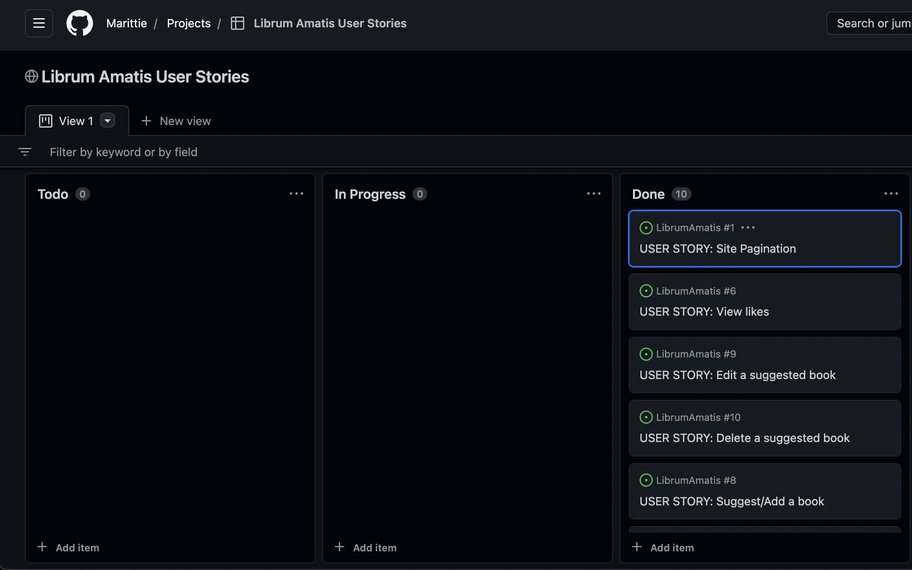

# Librum Amatis

Librum Amatis is a book sharing site for anyone that has passion in reading. It provides users a clear and simple way to browse and share books.

You can reach the live site [here](https://librum-amatis.herokuapp.com/)

# Table of contents   
- [Librum Amatis](#librum-amatis)
- [Table of contents](#table-of-contents)
- [User-Experience-Design](#user-experience-design)
  * [Site Goals](#site-goals)
  * [Agile Planning](#agile-planning)
  * [Scope](#scope)
  * [Structure](#structure)
    + [Librum Amatis Features](#librum-amatis-features)
    + [Home Page](#home-page)
    + [Footer](#footer)
    + [Books](#books-page)
    + [Book Detail](#books-detail)
    + [Sign in, log in, log out](#sign-in--log-in--log-out)
    + [Add a Book](#create-idea)
    + [Edit and Delete a Book](#edit-and-delete-book)
- [Wireframes](#wireframes)
- [Database](#database)
- [Security](#security)
- [Design](#design)
  * [Colour Scheme](#colour-scheme)
  * [Typogropny](#typogropny)
  * [Imagery](#imagery)
- [Technologies](#technologies)
- [Testing](#testing)
  * [Functional Testing](#functional-testing)
    + [Navigation Links](#navigation-links)
    + [Footer](#footer-1)
    + [Sign Up Page](#sign-up-page)
    + [Log out Page](#log-out-page)
    + [Log in](#log-in)
    + [Add a Book Page](#create-book-page)
    + [Edit Book](#edit-book)
    + [Delete a Book](#delete-a-book)
    + [Review on a book](#review-on-a-book)
  * [Accessibility](#accessibility)
  * [Validator Testing](#validator-testing)
  * [PP8 Validator](#pp8-validator)
  * [Lighthouse Report](#lighthouse-report)
- [Responsiveness](#responsiveness)
- [Bugs](#bugs)
- [Deployment](#deployment)
- [References](#references)
- [Acknowledgements](#acknowledgements)

# User-Experience-Design

## Site Goals

The site is aimed at anyone that is in search of a new book to read and to share the loved ones already read.  Without signing in the user can see the book. They wile be able, once registered to log on and share books the loved to read and review on other book already present.  They will also be able to edit and delete their books.

## Agile Planning

This project was developed using agile methodologies.Github issues were used to create the User stories and group them accordingly. 

My kanban board was made using github projects which can be viewed [here](https://github.com/users/Marittie/projects/6/views/1).  Each view can be clicked in to obtain further information.

## User Stories

[#1] As a Site User I can view a paginated list of posts so that easily navigate to a post to view.
[#2] As a Site User I can register to the blog so that interact and add new post.
[#3] As a Site User I can login and logout so that I can comment, edit and add posts.
[#4] As a Site User I can Like/Unlike posts so that I can interact with the content.
[#5] As a Site User I can review a post so that I can interact with the posts.
[#6] As a Site Used/Admin I can view the number of likes on each post so that I can see which is the most liked book.
[#7] As a Site User/Admin I can view reviews on an individual book so that I can read the conversation.
[#8] As a Site User/Admin I can Suggest/Add a new book so that I can laeve a review for others to read.
[#9] As a Site User/Admin I can edit my posts so that I can make corrections or be more detailed about it.
[#10] As a Site User/Admin I can delete my post so that It is not visible anymore.

## Scope
- Responsive Design
- Home page with information about Librum Amatis
- Ability to perform CRUD functionality on books
- Restricted features for not logged in users

## Structure

### Librum Amatis Features

Navbar

The user is able to navigate easily around the site from any devise

Navigation Menu

When the user is not logged in the navigation menu links to the Home page, Book page, Sign up anf Log in.

Once the user has signed in the navigation menu changes to Home, Books, Add a Book and Log out.
The user will also receive a toast message saying they have successfully signed in.

The sign in, log in, log out pages were made using allauth.

on smaller devices, the menu options collapse into a button

### Home Page

The front page contains a hero image of an open Book. This will make it evident to the user that the website is about books.
The user will find a clear explaination about the website.

### Footer

The Footer has been added to the bottom of the site and contains links to social media sites so that users can also share their books and promote the site via social media.

### Book Detail 

Each Book title is a link which opens up to a full page which contains the book's cover, and reviews about it.

Logged-on users can also comment on and like the books.

### Sign in, log in, log out

Users can log in and out using various forms and confirmation pages. These forms were made using allauth and edited using bootstrap.

### Add a Book

Once the user is logged in they can add their own favourite books using the Add a Book form.  The forms were made using crispy forms which were used in conjunction with bootstrap.

### Edit and Delete a Book

The creator of a Book will be able to view  the edit and delete icons on their book detail page.  The edit button will take them to the Add a Book form but it will be pre-populated with information that is already saved. The user can then update the information and save it again where they will be redirected back to the Book page.

The delete button will take the user to a confirmation page asking them to confirm they wish to delete that idea.  Once an idea is deleted all comments will be deleted with it.

The delete and edit views use LoginRequiredMixin and UserPassesTestMixin to ensure that only the idea creator who is logged in can update or delete their Books.

# Wireframes

Home Page

Sign Up

Log In

Log out

Books Page

book Detail

Create/Edit Book Form

Delete Book Conirmation

# Database

The data was designed to give the user CRUD functionality once signed in. Books are connected to the author by foreign key which allows users to edit and delete Books connected to their account. 

# Security

Views were secured by using the django based view mixin, UserPassesTestMixin.  A test function was created to use the mixin and checks that the user is authorised to access the page.  an if statement is also used in books_detail.html to hide the delete and edit buttons if the user is not authorised.  

Environment variables were stored in an env.py file for security purposes to ensure no secret keys, api keys or sensitive information were added to the repository.  These variables were added to heroku config vars within the project.

# Design

## Colour Scheme

I opted for a simple colour scheme.  It needed to be neutral and relaxing for the eye . I also wanted it to be neutral so that the user books stood out.  with this in mind, I went for a background colour of whitesmoke and a text colour of a shade of green

## Typography

I used 'Raleway' for the body of the site and  'Moon Dance' for the  heading.

I downloaded these from google fonts and imported them into the style sheet.

## Imagery  

The placeholder image was taken from pexels and is royalty free.  I chose a generic picture of an open book.  It is bright and relaxing.

# Technologies

- HTML
  - The structure of the site was made using HTML
- CSS
  - The website was styled using CSS in an external stylesheet 
- Python 
  - Python was the main programming language used within the django app
- Github
  - Source code was hosted in Github
- Git
  - Git was used to write, commit and push code during development 
- Font Awesome
  - Various Font Awesome icons were used throughout the site
- Balsamiq
  - Balsamiq wireframes were used to plan 
- javascript
  - I used a very small amount of javascript to make the toast messages disappear

# Testing

## Functional Testing

### Navigation Links

Testing was performed on on all navigation links throughout the site.  I achieved this by clicking on each link to ensure it went to the correct place.

Librum Amatis Logo => index.html
Home page => index.html
Books => books.html
Book Title => book_detail.html
Delete Button => book_delete.html
Edit Button => book_edit.html
Edit Button Submit Button => books.html
Sign Up => signup.html
Add a Book = > create_book.html
Add a Book Submit Button => books.html
Log In => login.html
Log Out => logout.html

All navigation links worked as expected

### Footer

All the font awesome icons in the footer opened to their respective websites, in a new window, as expected.

### Sign Up Page

Testing was taken out to ensure a user could sign up to the website.
Steps:
- Navigate to [Librum Amatis](https://librumamatis.herokuapp.com/)
- Navigate to the Sign Up page
- Enter User Name and Password, email is optional
- Click Sign Up

Expected outcome: User is redirected to the home page.  The Navbar changed to show the Add a Book option and log out option.
Actual outcome: User is redirected to the home page.  The Navbar changed to show the Add a Book potion and log out option.

### Log out Page

Testing was taken out to ensure a user could log out of the website.
Steps:
- Navigate to Log Out page
- Click Confirm button

Expected outcome: User is taken back to the homepage with the Add a Book option hidden and the Sign up option showing.
Actual outcome: User is taken back to the homepage with the Add a Book option hidden and the Sign up option showing.

### Log in

Testing was taken out to ensure a user could log in to the website.
Steps:
- Navigate to [Librum Amatis](https://librumamatis.herokuapp.com/)
- Navigate to Log In page
- Enter User Name and Password
- Click Sign in

Expected outcome: User is redirected to the home page.  The Navbar changes to show the Add a Book option and log out options. A message appears to say they have successfully logged in.
Actual outcome: User is redirected to the home page.  The Navbar changed to show the Add a book option and log out option. A message appears to say they have successfully logged in.

### Add a Book Page

Testing was taken out to ensure the user could create a new book.

Assuming user is already logged in
Steps:
- Navigate to Add a Book page
- Complete form
  - Book Title
  - Writer
  - Upload Image (optional)
  - Review (optional)
- Click Submit

  Expected Outcome if all fields are filled in correctly the user will be redirected to the Books page where they can view their book. 
  Expected outcome if the fields are not filled in correctly: A notice to complete the field appears and the cursor goes to the field that needs to be completed.

  Both of these outcomes happened correctly when tested.

### Edit Idea

Tested to ensure the user could edit their book.

Assuming the user is logged in
Steps:
- Navigate to the Books page
- Click on the Book Title
- If the user is the Author of the post, they will see a delete button and an Edit button under the Book title
- Click the edit button
- Update the fields you wish to update
- Click Submit

Expected outcome:  The user will be redirected back to the Books page which will show the new information.
The outcome was as expected.

### Delete a Book

Tested to ensure a user could delete their book.

Assuming the user is logged in
Steps:
- Navigate to the Books page
- Click on the Book Title
- If the user is the Author of the post, they will see a delete button and an Edit button under the Book Title
- Click the delete button
- User is taken to a Delete confirmation page asking them if their wish to delete that book showing the Book title.
- Click Submit

Expected outcome:  The user will be redirected back to the Books page and the book along with the review will be deleted.

The outcome was as expected.

### Review on a book

First I checked the review section when the user is Logged out.
As expected there is no option to enter a review at all.  You can view other people’s review but the box to write your own review is hidden.

If the user is logged in:
Steps
- Navigate to Books
- Click on the Book Title
- scroll down to the review section.
- Write your review in the comments box
- Click submit

Expected outcome: The review will appear in the review section on top of the review box.

The outcome works as expected.

## Accessibility

I used the [Wave Accessibility](https://wave.webaim.org/) tool to check for aid accessibility testing.

All pages came up with zero errors.

## PP8 Validator

All pages were run through the [PEP8 Validator  ](http://pep8online.com/).

No errors from codes written by me. Some errors showing about the django forms codes.

## Lighthouse Report

The lighthouse report initially showed a low score on performance.  I compressed my hero image which fixed the problem.

# Responsiveness

I checked the website for responsiveness on all devices from 320px and up.  I checked on Chrome, Edge, Firefox and Opera browsers.

I did this by using developer tools and resizing the website to down to 320px.

As expected there were no responsiveness issues.

# Bugs

No Bugs were found.

# Deployment

To deploy my site to Heroku I followed the following steps

- Navigate to heroku and create/log into account
- Click the new button in the top right corner
- Select create new app
- Enter app name (kids-bored)
- Select region and click create app (europe)
- Click the resources tab and search for Heroku Postgres
- Select hobby dev and continue
- Go to the settings tab and then click reveal config vars
- Add the following config vars:
  - SECRET_KEY: (Your secret key)
  - DATABASE_URL: (This should already exist with add on of postgres)
  - EMAIL_HOST_USER: (email address)
  - EMAIL_HOST_PASS: (email app password)
  - CLOUNDINARY_URL: (cloudinary api url)
- Click the deploy tab
- Scroll down to Connect to GitHub and sign in / authorize when prompted
- In the search box, find the repository you want to deploy and click connect
- Scroll down to Manual deploy and choose the main branch
- Click Deploy

The app should now be deployed

# References

- I followed the Code Institute Blog walkthrough to start my project off.
- I used the django documentation 
- I used the summernote documentation
- I used the bootstrap documentation

# Acknowledgements

I want to thank:

- The Tutor Support for the enormous help during struggling times.
- My friends for testing the Web site.
- My Business Partner for covering me during this time.